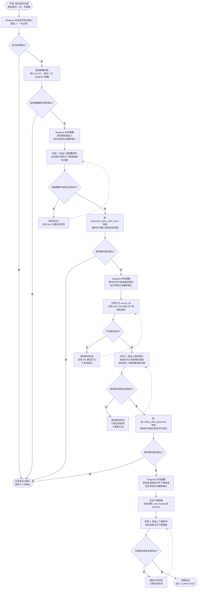

# Telegram 确认到加密文件投递流程图

更新时间：2026-06-01

本文用于留底和后续调整触发节奏。此版本按新的目标流程梳理：**每月固定日期给用户发送 Telegram 安全确认；如果连续提醒期内仍未确认，再通知受益人；随后按配置等待，先打包并发送密码，再按配置等待后发送加密文件下载链接。**

## 当前状态说明

- 当前目标流程：每月固定日期发送 Telegram 安全确认，例如每月 1 号，可配置。
- 当前目标流程：平时不提前打包；到“发送密码”阶段才打包，打包成功后把本次生成的密码发送给受益人。
- 当前目标流程：每个给受益人发送邮件的阶段，同时给用户本人发送 Telegram 阶段提醒，并提示如果一切正常请点击最新确认按钮暂停后续流程。
- 当前代码已实现：月度确认、连续提醒、阶段 Telegram 提醒，以及“到密码阶段才打包并发送密码”的主调度流程。
- 当前目标流程：不再判断压缩包大小，所有加密文件统一通过下载链接发送。
- 当前代码已实现：self_hosted 下载端点、S3-compatible 上传与预签名链接，以及统一下载链接投递。

## 目标主流程



## 默认时间线

以下以“每月 1 号发送确认，`reminder_count=7`、`reminder_interval=24h`，`password_delay_after_warn=72h`，`file_delay_after_password=168h`”为例。实际日期应由配置计算；配置变化后，D8/D11/D18 都只是示例节点，不是固定日期。

| 相对时间 | 触发条件 | 发送对象 | 渠道 | 发送内容 | 用户还能否取消 |
|---:|---|---|---|---|---|
| D0 | 每月确认日，例如每月 1 号 | 用户本人 | Telegram | 🟢 定时安全确认 + 当前日期 + “✅ 一切正常”按钮 | 可以，点击后回到正常，等待下个月 |
| D1-D7 示例 | D0 未确认后进入连续提醒期，默认 7 天 | 用户本人 | Telegram | 每天提醒一次安全确认，提示如果正常请点击最新按钮 | 可以 |
| D8 示例 | 连续提醒期结束后仍未确认 | 用户本人 + 受益人 | Telegram + Email | Telegram 告知用户即将通知受益人；Email 给受益人发送预提醒 | 可以，点击最新确认后暂停后续流程 |
| D11 示例 | 受益人预提醒后等待 `password_delay_after_warn` 仍未确认 | 用户本人 + 受益人 | Telegram + Email | Telegram 告知用户即将打包并发送密码；系统打包后给受益人发送解压密码，并告知预计下载链接发送日期 | 可以，点击最新确认后暂停链接发送 |
| D18 示例 | 密码邮件后等待 `file_delay_after_password` 仍未确认 | 用户本人 + 受益人 | Telegram + Email | Telegram 告知用户即将发送下载链接；Email 给受益人发送加密文件下载链接 | 下载邮件投递前仍可确认暂停；投递成功后无法撤回已发送邮件 |

> 注意：实际发送时间会受 `--tick` 周期影响，可能比表格略晚一个 tick 周期。

## 发送文案建议

### D0：每月 Telegram 安全确认

发送给：用户本人。

渠道：Telegram。

```text
🟢 定时安全确认
<当前日期>

点击下方按钮确认一切正常。
```

按钮：

```text
✅ 一切正常
```

点击成功后的 Telegram 回调：

```text
本月已确认，祝君安康！
```

### 连续提醒阶段：Telegram 提醒

发送给：用户本人。

渠道：Telegram。

按钮：

```text
✅ 一切正常
```

流程图中用 `N = 1..reminder_count` 的循环表示，每隔 `reminder_interval` 发一次，不再逐天展开。默认 `reminder_count=7`、`reminder_interval=24h`，第 `reminder_count` 次使用最后连续提醒文案。

普通提醒建议文案：

```text
🟡 安全确认提醒
系统已<N>天没收到你的确认。

如果你一切正常，请点击最新确认消息中的“一切正常”按钮。
```

最后一天建议文案：

```text
🔴 最后安全确认提醒
这是本轮连续提醒的最后一天。

如果你一切正常，请尽快点击最新确认消息中的“一切正常”按钮。若仍未确认，系统将进入预设通知流程。
```

### 通知受益人前的 Telegram 阶段提醒

发送给：用户本人。

渠道：Telegram。

按钮：

```text
✅ 一切正常
```

```text
⚠️ 阶段提醒 · 预提醒邮件
系统即将向受益人发送预提醒邮件。

如果你一切正常，请立即点击最新安全确认消息中的“一切正常”按钮，系统会暂停后续流程。
```

### 受益人预提醒邮件

发送给：所有受益人。

渠道：Email。

中文主题：

```text
[重要] 一封预定的信息
```

中文正文建议：

```text
您好 {name}，

这是一封由 {owner} 预先设置的自动邮件。{owner} 设置了一套机制：若他/她本人长期未完成安全确认，系统会按预设流程向您传递重要信息。

目前系统已经连续多天未收到 {owner} 的安全确认。

如果接下来仍未收到 {owner} 的安全确认，系统将按配置继续执行：

- 预计在 {password_delay_text} 后即 {password_send_date} 给您发送重要文件的解压密码，请妥善保管。
- 预计在密码发送后 {file_delay_text} 即 {file_link_send_date} 给您发送加密文件下载链接，下载后可使用届时收到的密码解密。此日期为当前预估值，实际日期会在密码邮件中重新确认。

解压加密文件需要使用 7-Zip 或 WinRAR。Windows 自带解压工具通常不支持此类 AES 加密 ZIP。

若这是误触发，{owner} 仍可通过 Telegram 确认暂停后续流程，您可能不会再收到后续邮件。
```

占位符计算说明：

- `{password_delay_text}`：由配置 `password_delay_after_warn` 换算为自然语言时长，例如 `3 天`、`36 小时`。
- `{file_delay_text}`：由配置 `file_delay_after_password` 换算为自然语言时长，例如 `7 天`、`90 小时`。
- `{password_send_date}`：预提醒邮件全部成功时间 + `password_delay_after_warn`。
- 预提醒邮件中的 `{file_link_send_date}`：按 `{password_send_date}` + `file_delay_after_password` 计算的预估下载链接发送日期。
- 密码邮件中的 `{file_link_send_date}`：密码邮件全部成功时间 + `file_delay_after_password`。若密码邮件发生重试，应使用重试成功后的时间重新计算，避免预计日期偏早。

### 密码阶段：发送密码前的 Telegram 阶段提醒

发送给：用户本人。

渠道：Telegram。

```text
🔐 阶段提醒 · 解压密码
系统即将打包文件，并向受益人发送解压密码。

如果你一切正常，请立即点击最新安全确认消息中的“一切正常”按钮，系统会暂停后续流程。
```

### 密码阶段：受益人密码邮件

发送前动作：

```text
立即打包 source_dir，生成本次触发流程专用的 AES-256 加密 ZIP 和随机密码。
```

打包失败时：

```text
不发送密码，保持当前阶段，后续 tick 重试打包。
```

发送给：所有受益人。

渠道：Email。

中文主题：

```text
[重要] 解压密码
```

中文正文建议：

```text
您好 {name}，

这是此前预提醒邮件中提到的解压密码：

{password}

请妥善保存。预计在 {file_delay_text} 后即 {file_link_send_date}，您会收到加密文件下载链接。下载文件后，请使用此密码并通过 7-Zip 或 WinRAR 解压。
```

### 下载链接阶段：发送下载链接前的 Telegram 阶段提醒

发送给：用户本人。

渠道：Telegram。

```text
🔗 阶段提醒 · 下载链接
系统即将向受益人发送加密文件下载链接。

如果你一切正常，请立即点击最新安全确认消息中的“一切正常”按钮，系统会暂停后续流程。
```

### 下载链接阶段：受益人下载链接邮件

所有加密文件统一通过下载链接发送，不再根据压缩包大小走附件分支。

中文主题：

```text
[重要] 加密文件下载链接
```

中文正文建议：

```text
您好 {name}，

请通过以下链接下载加密文件：

{url}

链接有效期：{expiry}
最多下载次数：{max_downloads}

请使用此前收到的解压密码，并通过 7-Zip 或 WinRAR 解压。
```

## 关键规则

- 每轮确认只接受最新 Telegram 按钮的一次性 token。
- 用户在 D0 到下载链接邮件投递成功前任意阶段确认，都应暂停后续流程并回到正常状态。
- 密码阶段打包成功后，密码邮件重试不能重新打包，避免不同受益人收到的密码和最终下载文件不一致。
- 每个受益人、每个阶段都需要幂等投递记录；已成功投递的不重复发送，失败项后续重试。
- 下载链接一旦投递给受益人，无法撤回已发送邮件；只能通过链接过期时间和下载次数限制控制后续访问。

## 关键配置项

| 配置项 | 示例 | 含义 |
|---|---:|---|
| `checkin_day_of_month` | `1` | 每月几号发送安全确认 |
| `reminder_count` | `7` | 未确认后连续提醒几次 |
| `reminder_interval` | `24h` | 两次提醒间隔（Go duration） |
| `password_delay_after_warn` | `72h` | 通知受益人后多久发送密码 |
| `file_delay_after_password` | `168h` | 发送密码后多久发送下载链接 |
| `timezone` | `Asia/Shanghai` | 月度确认日和预计发送日期展示时区 |
| `download.link_expiry` | `336h` | 下载链接有效期 |
| `download.max_downloads` | `5` | 下载链接最多允许下载次数 |

## 当前实现状态

- 当前代码已使用 `target_flow.checkin_day_of_month`、`target_flow.reminder_count` 和 `target_flow.reminder_interval` 执行“每月固定日期 + 连续提醒期”流程。
- 当前代码不再周期性提前打包；目标流程只在密码阶段到达后才打包。
- 当前代码已实现受益人预提醒、密码邮件、下载链接邮件三个阶段前的 Telegram 阶段提醒，并通过幂等记录避免重复提醒。
- 当前代码已移除文件阶段附件投递分支，统一生成下载链接。
- `download.mode=self_hosted` 会生成本机下载 token；`download.mode=s3` 会上传归档到 S3-compatible 对象存储并生成预签名链接。真实对象存储仍需部署环境联调。
